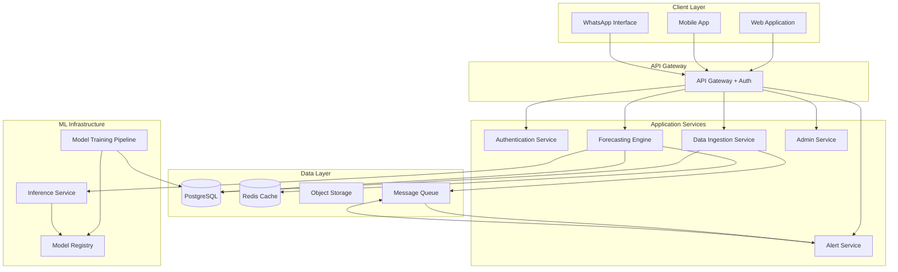

# Design Document: Kirana Inventory Forecasting System

## Overview

The Kirana Inventory Forecasting System is a cloud-based platform that uses machine learning to help small retail stores predict product demand and optimize inventory levels. The system is designed with accessibility and affordability in mind, supporting multiple input channels (web, mobile, WhatsApp) and using phone numbers as the primary store identifier to simplify onboarding.

The architecture follows a microservices pattern with clear separation between data ingestion, forecasting engine, notification services, and user interfaces. The system uses time-series forecasting models (ARIMA, Prophet, or LSTM) to generate demand predictions and provides actionable insights through dashboards and alerts.

## Architecture

### High-Level Architecture



### Technology Stack

**Frontend:**
- Web: React.js with TypeScript, Chart.js for visualizations
- Mobile: React Native for cross-platform Android/iOS support
- State Management: Redux Toolkit

**Backend:**
- API Gateway: Node.js with Express.js
- Services: Python (FastAPI) for ML services, Node.js for business logic
- Authentication: JWT tokens with phone-based OTP verification

**Data Layer:**
- Primary Database: PostgreSQL for transactional data
- Cache: Redis for session management and frequently accessed forecasts
- Object Storage: AWS S3 or compatible for CSV files and model artifacts
- Message Queue: RabbitMQ or AWS SQS for async processing

**ML Infrastructure:**
- Training: Python with scikit-learn, Prophet, TensorFlow/PyTorch
- Model Serving: TensorFlow Serving or FastAPI-based inference service
- Model Registry: MLflow for versioning and tracking

**Infrastructure:**
- Cloud Provider: AWS, Google Cloud, or Azure
- Container Orchestration: Docker + Kubernetes or AWS ECS
- CI/CD: GitHub Actions or GitLab CI

## Components and Interfaces

### 1. Authentication Service

**Responsibilities:**
- User registration and phone verification via OTP
- JWT token generation and validation
- Role-based access control (Store Owner, Staff, Admin)
- Session management

**Interfaces:**

```typescript
interface AuthService {
  // Register new user with phone number
  registerUser(phoneNumber: string, password: string, storeName: string): Promise<RegistrationResult>
  
  // Send OTP for phone verification
  sendOTP(phoneNumber: string): Promise<OTPResult>
  
  // Verify OTP code
  verifyOTP(phoneNumber: string, otpCode: string): Promise<VerificationResult>
  
  // Authenticate user and return JWT
  login(phoneNumber: string, password: string): Promise<AuthToken>
  
  // Validate JWT token
  validateToken(token: string): Promise<TokenValidation>
  
  // Refresh expired token
  refreshToken(refreshToken: string): Promise<AuthToken>
  
  // Check user permissions
  checkPermission(userId: string, resource: string, action: string): Promise<boolean>
}

interface RegistrationResult {
  success: boolean
  userId?: string
  storeId?: string
  error?: string
}

interface AuthToken {
  accessToken: string
  refreshToken: string
  expiresIn: number
  userId: string
  role: UserRole
}

enum UserRole {
  STORE_OWNER = "store_owner",
  STORE_STAFF = "store_staff",
  ADMIN = "admin"
}
```

### 2. Data Ingestion Service

**Responsibilities:**
- Accept sales data from multiple channels (web, mobile, WhatsApp)
- Validate and sanitize input data
- Parse and import CSV files
- Store sales records with proper indexing

**Interfaces:**

```typescript
interface DataIngestionService {
  // Add single sales record
  addSalesRecord(storeId: string, record: SalesRecord): Promise<IngestionResult>
  
  // Bulk import from CSV
  importCSV(storeId: string, fileUrl: string): Promise<ImportResult>
  
  // Process WhatsApp message
  processWhatsAppMessage(phoneNumber: string, message: string): Promise<WhatsAppResponse>
  
  // Validate sales data
  validateSalesData(record: SalesRecord): ValidationResult
  
  // Get sales history
  getSalesHistory(storeId: string, filters: SalesFilters): Promise<SalesRecord[]>
}

interface SalesRecord {
  storeId: string
  productName: string
  quantitySold: number
  date: Date
  category?: string
  unitPrice?: number
}

interface SalesFilters {
  startDate?: Date
  endDate?: Date
  productName?: string
  category?: string
  limit?: number
  offset?: number
}

interface ImportResult {
  success: boolean
  recordsImported: number
  recordsFailed: number
  errors?: ImportError[]
}

interface ImportError {
  row: number
  field: string
  error: string
}
```

### 3. Forecasting Engine

**Responsibilities:**
- Generate demand forecasts for 7, 14, and 30-day periods
- Train and update ML models based on new data
- Calculate confidence intervals
- Track forecast accuracy

**Interfaces:**

```typescript
interface ForecastingEngine {
  // Generate forecast for a product
  generateForecast(storeId: string, productName: string, periods: ForecastPeriod[]): Promise<ForecastResult>
  
  // Get existing forecast
  getForecast(storeId: string, productName: string, period: ForecastPeriod): Promise<Forecast>
  
  // Update forecasts for all products in a store
  updateStoreForecasts(storeId: string): Promise<UpdateResult>
  
  // Calculate forecast accuracy
  calculateAccuracy(storeId: string, productName: string): Promise<AccuracyMetrics>
  
  // Train model for a store
  trainModel(storeId: string): Promise<TrainingResult>
}

interface Forecast {
  storeId: string
  productName: string
  period: ForecastPeriod
  predictions: DailyPrediction[]
  confidenceInterval: ConfidenceInterval
  generatedAt: Date
  modelVersion: string
}

interface DailyPrediction {
  date: Date
  predictedQuantity: number
  lowerBound: number
  upperBound: number
}

interface ConfidenceInterval {
  level: number  // e.g., 95 for 95% confidence
  lowerBound: number[]
  upperBound: number[]
}

enum ForecastPeriod {
  SEVEN_DAYS = 7,
  FOURTEEN_DAYS = 14,
  THIRTY_DAYS = 30
}

interface AccuracyMetrics {
  mape: number  // Mean Absolute Percentage Error
  rmse: number  // Root Mean Square Error
  mae: number   // Mean Absolute Error
  historicalAccuracy: AccuracyPoint[]
}

interface AccuracyPoint {
  date: Date
  accuracy: number
}
```

### 4. Inventory Management Service

**Responsibilities:**
- Track current stock levels
- Calculate reorder quantities
- Detect overstock and stockout situations
- Generate reorder recommendations

**Interfaces:**

```typescript
interface InventoryService {
  // Update current stock level
  updateStock(storeId: string, productName: string, quantity: number): Promise<StockUpdate>
  
  // Get current inventory status
  getInventoryStatus(storeId: string): Promise<InventoryStatus>
  
  // Calculate reorder quantity
  calculateReorderQuantity(storeId: string, productName: string, leadTimeDays: number): Promise<ReorderRecommendation>
  
  // Get reorder recommendations
  getReorderRecommendations(storeId: string): Promise<ReorderRecommendation[]>
  
  // Detect overstock items
  detectOverstock(storeId: string): Promise<OverstockItem[]>
  
  // Set minimum stock threshold
  setMinimumThreshold(storeId: string, productName: string, threshold: number): Promise<void>
}

interface InventoryStatus {
  storeId: string
  totalProducts: number
  optimalStock: number
  lowStock: number
  outOfStock: number
  overstock: number
  inventoryValue: number
}

interface ReorderRecommendation {
  productName: string
  currentStock: number
  forecastedDemand: number
  reorderQuantity: number
  reorderPoint: number
  urgency: UrgencyLevel
  estimatedStockoutDate?: Date
}

enum UrgencyLevel {
  LOW = "low",
  MEDIUM = "medium",
  HIGH = "high",
  CRITICAL = "critical"
}

interface OverstockItem {
  productName: string
  currentStock: number
  forecastedDemand: number
  daysOfSupply: number
  valueAtRisk: number
}
```

### 5. Alert Service

**Responsibilities:**
- Generate stock alerts based on thresholds
- Send notifications via multiple channels (in-app, email, WhatsApp)
- Manage alert preferences
- Track alert history

**Interfaces:**

```typescript
interface AlertService {
  // Generate stock alert
  generateAlert(storeId: string, alert: StockAlert): Promise<void>
  
  // Send notification
  sendNotification(userId: string, notification: Notification): Promise<NotificationResult>
  
  // Get active alerts
  getActiveAlerts(storeId: string): Promise<StockAlert[]>
  
  // Acknowledge alert
  acknowledgeAlert(alertId: string, userId: string): Promise<void>
  
  // Configure alert preferences
  setAlertPreferences(userId: string, preferences: AlertPreferences): Promise<void>
}

interface StockAlert {
  alertId: string
  storeId: string
  productName: string
  alertType: AlertType
  severity: UrgencyLevel
  message: string
  currentStock: number
  threshold: number
  createdAt: Date
  acknowledged: boolean
}

enum AlertType {
  LOW_STOCK = "low_stock",
  OUT_OF_STOCK = "out_of_stock",
  OVERSTOCK = "overstock",
  FORECAST_ACCURACY_LOW = "forecast_accuracy_low"
}

interface Notification {
  userId: string
  title: string
  message: string
  channels: NotificationChannel[]
  priority: UrgencyLevel
}

enum NotificationChannel {
  IN_APP = "in_app",
  EMAIL = "email",
  WHATSAPP = "whatsapp",
  SMS = "sms"
}

interface AlertPreferences {
  enabledChannels: NotificationChannel[]
  quietHoursStart?: string  // e.g., "22:00"
  quietHoursEnd?: string    // e.g., "08:00"
  minimumSeverity: UrgencyLevel
}
```

### 6. Dashboard Service

**Responsibilities:**
- Aggregate data for visualization
- Generate sales trend analytics
- Calculate inventory health metrics
- Provide multi-store consolidated views

**Interfaces:**

```typescript
interface DashboardService {
  // Get dashboard overview
  getDashboardOverview(storeId: string): Promise<DashboardData>
  
  // Get sales trends
  getSalesTrends(storeId: string, dateRange: DateRange): Promise<SalesTrend[]>
  
  // Get inventory health
  getInventoryHealth(storeId: string): Promise<InventoryHealth>
  
  // Get top products
  getTopProducts(storeId: string, metric: ProductMetric, limit: number): Promise<ProductRanking[]>
  
  // Get multi-store view
  getMultiStoreView(userId: string): Promise<MultiStoreData>
}

interface DashboardData {
  storeId: string
  storeName: string
  salesTrends: SalesTrend[]
  inventoryHealth: InventoryHealth
  topProducts: ProductRanking[]
  recentAlerts: StockAlert[]
  forecastAccuracy: number
}

interface SalesTrend {
  date: Date
  totalSales: number
  totalRevenue: number
  productCount: number
}

interface InventoryHealth {
  optimalStockPercentage: number
  lowStockCount: number
  outOfStockCount: number
  overstockCount: number
  totalValue: number
  statusByProduct: ProductStatus[]
}

interface ProductStatus {
  productName: string
  status: InventoryStatusType
  currentStock: number
  optimalStock: number
}

enum InventoryStatusType {
  OPTIMAL = "optimal",
  LOW = "low",
  OUT = "out",
  OVERSTOCK = "overstock"
}

interface ProductRanking {
  rank: number
  productName: string
  value: number
  trend: TrendDirection
}

enum ProductMetric {
  SALES_VOLUME = "sales_volume",
  REVENUE = "revenue",
  PROFIT_MARGIN = "profit_margin",
  TURNOVER_RATE = "turnover_rate"
}

enum TrendDirection {
  UP = "up",
  DOWN = "down",
  STABLE = "stable"
}
```

### 7. WhatsApp Integration Service

**Responsibilities:**
- Parse WhatsApp messages for commands
- Format responses for WhatsApp
- Handle authentication via phone number
- Support conversational data entry

**Interfaces:**

```typescript
interface WhatsAppService {
  // Process incoming WhatsApp message
  processMessage(phoneNumber: string, message: string): Promise<WhatsAppResponse>
  
  // Send WhatsApp message
  sendMessage(phoneNumber: string, message: string): Promise<SendResult>
  
  // Parse sales data from message
  parseSalesData(message: string): ParseResult<SalesRecord>
  
  // Generate help message
  getHelpMessage(): string
}

interface WhatsAppResponse {
  success: boolean
  message: string
  data?: any
}

interface ParseResult<T> {
  success: boolean
  data?: T
  error?: string
}

// Example WhatsApp message formats:
// "SALES Rice 10kg 5" -> Product: Rice 10kg, Quantity: 5
// "STOCK Rice 10kg" -> Check stock for Rice 10kg
// "REORDER" -> Get reorder recommendations
// "HELP" -> Get command list
```

### 8. Admin Service

**Responsibilities:**
- Manage stores, products, and users
- View system-wide analytics
- Audit logging
- System configuration

**Interfaces:**

```typescript
interface AdminService {
  // Get all stores
  getAllStores(filters: StoreFilters): Promise<Store[]>
  
  // Deactivate/reactivate store
  setStoreStatus(storeId: string, active: boolean): Promise<void>
  
  // Get system analytics
  getSystemAnalytics(): Promise<SystemAnalytics>
  
  // View audit logs
  getAuditLogs(filters: AuditFilters): Promise<AuditLog[]>
  
  // Manage products globally
  manageProduct(action: ProductAction): Promise<void>
}

interface Store {
  storeId: string
  storeName: string
  phoneNumber: string
  ownerName: string
  active: boolean
  createdAt: Date
  productCount: number
  forecastCount: number
}

interface SystemAnalytics {
  totalStores: number
  activeStores: number
  totalForecasts: number
  averageForecastAccuracy: number
  totalSalesRecords: number
  systemUptime: number
}

interface AuditLog {
  logId: string
  timestamp: Date
  userId: string
  action: string
  resource: string
  details: any
}
```

## Data Models

### Core Entities

**User:**
```typescript
interface User {
  userId: string
  phoneNumber: string  // Primary identifier
  passwordHash: string
  role: UserRole
  verified: boolean
  createdAt: Date
  lastLogin: Date
}
```

**Store:**
```typescript
interface Store {
  storeId: string  // Derived from phone number
  storeName: string
  ownerUserId: string
  phoneNumber: string
  address?: string
  active: boolean
  createdAt: Date
  settings: StoreSettings
}

interface StoreSettings {
  defaultLeadTimeDays: number
  currency: string
  timezone: string
  alertPreferences: AlertPreferences
}
```

**Product:**
```typescript
interface Product {
  productId: string
  storeId: string
  productName: string
  category?: string
  currentStock: number
  minimumThreshold: number
  unitPrice?: number
  lastRestockDate?: Date
  createdAt: Date
}
```

**Sales Record:**
```typescript
interface SalesRecord {
  recordId: string
  storeId: string
  productId: string
  productName: string
  quantitySold: number
  saleDate: Date
  unitPrice?: number
  totalRevenue?: number
  createdAt: Date
}
```

**Forecast:**
```typescript
interface ForecastRecord {
  forecastId: string
  storeId: string
  productId: string
  forecastPeriod: ForecastPeriod
  predictions: DailyPrediction[]
  confidenceLevel: number
  modelVersion: string
  generatedAt: Date
  expiresAt: Date
}
```

### Database Schema

**PostgreSQL Tables:**

```sql
-- Users table
CREATE TABLE users (
  user_id UUID PRIMARY KEY DEFAULT gen_random_uuid(),
  phone_number VARCHAR(15) UNIQUE NOT NULL,
  password_hash VARCHAR(255) NOT NULL,
  role VARCHAR(20) NOT NULL,
  verified BOOLEAN DEFAULT FALSE,
  created_at TIMESTAMP DEFAULT CURRENT_TIMESTAMP,
  last_login TIMESTAMP
);

-- Stores table
CREATE TABLE stores (
  store_id UUID PRIMARY KEY DEFAULT gen_random_uuid(),
  store_name VARCHAR(255) NOT NULL,
  owner_user_id UUID REFERENCES users(user_id),
  phone_number VARCHAR(15) UNIQUE NOT NULL,
  address TEXT,
  active BOOLEAN DEFAULT TRUE,
  settings JSONB,
  created_at TIMESTAMP DEFAULT CURRENT_TIMESTAMP
);

-- Products table
CREATE TABLE products (
  product_id UUID PRIMARY KEY DEFAULT gen_random_uuid(),
  store_id UUID REFERENCES stores(store_id) ON DELETE CASCADE,
  product_name VARCHAR(255) NOT NULL,
  category VARCHAR(100),
  current_stock DECIMAL(10,2) DEFAULT 0,
  minimum_threshold DECIMAL(10,2) DEFAULT 0,
  unit_price DECIMAL(10,2),
  last_restock_date DATE,
  created_at TIMESTAMP DEFAULT CURRENT_TIMESTAMP,
  UNIQUE(store_id, product_name)
);

-- Sales records table
CREATE TABLE sales_records (
  record_id UUID PRIMARY KEY DEFAULT gen_random_uuid(),
  store_id UUID REFERENCES stores(store_id) ON DELETE CASCADE,
  product_id UUID REFERENCES products(product_id) ON DELETE CASCADE,
  product_name VARCHAR(255) NOT NULL,
  quantity_sold DECIMAL(10,2) NOT NULL,
  sale_date DATE NOT NULL,
  unit_price DECIMAL(10,2),
  total_revenue DECIMAL(10,2),
  created_at TIMESTAMP DEFAULT CURRENT_TIMESTAMP
);

-- Forecasts table
CREATE TABLE forecasts (
  forecast_id UUID PRIMARY KEY DEFAULT gen_random_uuid(),
  store_id UUID REFERENCES stores(store_id) ON DELETE CASCADE,
  product_id UUID REFERENCES products(product_id) ON DELETE CASCADE,
  forecast_period INTEGER NOT NULL,
  predictions JSONB NOT NULL,
  confidence_level DECIMAL(5,2),
  model_version VARCHAR(50),
  generated_at TIMESTAMP DEFAULT CURRENT_TIMESTAMP,
  expires_at TIMESTAMP
);

-- Alerts table
CREATE TABLE alerts (
  alert_id UUID PRIMARY KEY DEFAULT gen_random_uuid(),
  store_id UUID REFERENCES stores(store_id) ON DELETE CASCADE,
  product_id UUID REFERENCES products(product_id) ON DELETE CASCADE,
  alert_type VARCHAR(50) NOT NULL,
  severity VARCHAR(20) NOT NULL,
  message TEXT NOT NULL,
  current_stock DECIMAL(10,2),
  threshold DECIMAL(10,2),
  acknowledged BOOLEAN DEFAULT FALSE,
  created_at TIMESTAMP DEFAULT CURRENT_TIMESTAMP
);

-- Audit logs table
CREATE TABLE audit_logs (
  log_id UUID PRIMARY KEY DEFAULT gen_random_uuid(),
  user_id UUID REFERENCES users(user_id),
  action VARCHAR(100) NOT NULL,
  resource VARCHAR(100) NOT NULL,
  details JSONB,
  timestamp TIMESTAMP DEFAULT CURRENT_TIMESTAMP
);

-- Indexes for performance
CREATE INDEX idx_sales_store_date ON sales_records(store_id, sale_date);
CREATE INDEX idx_sales_product ON sales_records(product_id);
CREATE INDEX idx_forecasts_store_product ON forecasts(store_id, product_id);
CREATE INDEX idx_products_store ON products(store_id);
CREATE INDEX idx_alerts_store ON alerts(store_id, acknowledged);
```

## Correctness Properties

*A property is a characteristic or behavior that should hold true across all valid executions of a system—essentially, a formal statement about what the system should do. Properties serve as the bridge between human-readable specifications and machine-verifiable correctness guarantees.*


### Property 1: Sales Data Round-Trip Persistence

*For any* valid sales record submitted by a store owner, storing the record and then querying the database should return the same data with the correct Store_ID and timestamp attached.

**Validates: Requirements 1.2**

### Property 2: Invalid Sales Data Rejection

*For any* sales record with missing required fields (product name, quantity, or date), the system should reject the submission and return a specific error message indicating which field is missing.

**Validates: Requirements 1.3**

### Property 3: Negative Quantity Rejection

*For any* sales record with a negative quantity value, the system should reject the entry and return an error message.

**Validates: Requirements 1.4**

### Property 4: CSV Import Completeness

*For any* valid CSV file containing sales records, importing the file should result in all records being stored in the database, and the import summary count should match the actual number of rows in the CSV.

**Validates: Requirements 2.1, 2.4**

### Property 5: CSV Validation Error Reporting

*For any* CSV file containing invalid data formats, the system should reject the file and provide an error report that identifies each invalid row and the specific validation failure.

**Validates: Requirements 2.2**

### Property 6: CSV Required Columns Validation

*For any* CSV file missing one or more required columns (date, product_name, quantity_sold), the system should reject the file and indicate which columns are missing.

**Validates: Requirements 2.3**

### Property 7: Forecast Period Completeness

*For any* product with sufficient historical data (at least 14 days), requesting a demand forecast should return predictions for all three periods: 7-day, 14-day, and 30-day.

**Validates: Requirements 3.1**

### Property 8: Forecast Confidence Intervals

*For any* demand forecast generated, the forecast should include confidence intervals (lower bound and upper bound) for each daily prediction.

**Validates: Requirements 3.4**

### Property 9: Reorder Quantity Calculation

*For any* product with a demand forecast, the calculated reorder quantity should be based on forecasted demand, current stock level, lead time, and should include a safety stock buffer (making it greater than just the forecasted demand minus current stock).

**Validates: Requirements 4.1, 4.2, 4.5**

### Property 10: Reorder Recommendation Trigger

*For any* product where current stock level falls below the calculated reorder point, the system should generate a reorder recommendation.

**Validates: Requirements 4.3**

### Property 11: Recommendation Content Completeness

*For any* reorder recommendation or stock alert generated, it should contain all required fields: product name, current stock level, suggested/recommended quantity, and urgency/priority level.

**Validates: Requirements 4.4, 5.3**

### Property 12: Stock Alert Generation

*For any* product where current stock level falls below the configured minimum threshold, the system should generate a stock alert.

**Validates: Requirements 5.1**

### Property 13: Threshold Configuration Round-Trip

*For any* product and minimum stock threshold value, setting the threshold and then retrieving it should return the same threshold value.

**Validates: Requirements 5.4**

### Property 14: Overstock Detection and Prioritization

*For any* product where current stock exceeds 60 days of forecasted demand, the system should flag it as overstocked, calculate its financial value (quantity × unit price), provide suggestions, and prioritize alerts by inventory age and capital tied up.

**Validates: Requirements 6.1, 6.3, 6.4, 6.5**

### Property 15: Multi-Store Data Isolation

*For any* two different stores in the system, modifying sales data or inventory for one store should not affect the data of the other store - each store's data should be completely isolated.

**Validates: Requirements 7.2**

### Property 16: Multi-Store Consolidated View

*For any* user account with multiple stores, the consolidated multi-store view metrics (total sales, total inventory value, etc.) should equal the sum of the individual store metrics.

**Validates: Requirements 7.4**

### Property 17: Inventory Health Metrics Accuracy

*For any* store's inventory state, the inventory health indicators (stockout count, overstock count, low stock count, optimal stock percentage) should accurately reflect the actual count of products in each status category.

**Validates: Requirements 8.2, 11.4**

### Property 18: Inventory Status Color Mapping

*For any* product, the color code assigned should correctly match its inventory status: green for optimal stock, yellow for low stock, red for out of stock, orange for overstock.

**Validates: Requirements 8.4**

### Property 19: Product Ranking Order

*For any* set of products, when displaying top-selling or slow-moving products, the list should be correctly ordered by the selected metric (sales volume, revenue, etc.) in descending order for top-selling and ascending for slow-moving.

**Validates: Requirements 8.5**

### Property 20: Dashboard Filter Correctness

*For any* filter applied to dashboard data (date range, product category), all returned results should match the filter criteria - no results outside the filter should be included.

**Validates: Requirements 8.6**

### Property 21: WhatsApp Message Parsing

*For any* properly formatted WhatsApp message containing sales data (e.g., "SALES Rice 10kg 5"), the parser should correctly extract the product name and quantity, and store it in the database.

**Validates: Requirements 9.1**

### Property 22: WhatsApp Response Guarantee

*For any* WhatsApp message processed (valid or invalid), the system should send a response message - either a confirmation for valid commands or usage instructions for invalid commands.

**Validates: Requirements 9.2, 9.4**

### Property 23: WhatsApp Authentication

*For any* WhatsApp command received from an unregistered phone number, the system should reject the command and not process any data operations.

**Validates: Requirements 9.5**

### Property 24: Password Validation Rules

*For any* password string, the validation should correctly accept passwords with at least 8 characters, one number, and one uppercase letter, and reject passwords that don't meet these criteria.

**Validates: Requirements 10.2**

### Property 25: Unauthorized Access Denial

*For any* attempt by a user to access data belonging to a different store without proper authorization, the system should deny access and create an audit log entry.

**Validates: Requirements 10.3**

### Property 26: Role-Based Permissions

*For any* user with a specific role (Store_Owner, Store_Staff, Admin), access to resources should be granted or denied according to the role's defined permissions - Store_Staff should not access owner functions, non-Admins should not access admin functions.

**Validates: Requirements 10.4**

### Property 27: Admin Universal Access

*For any* store, product, or user resource in the system, an Admin role should have read access to view the resource.

**Validates: Requirements 11.1**

### Property 28: Admin Action Audit Logging

*For any* modification or sensitive data access performed by an Admin, the system should create an audit log entry containing the timestamp, admin identifier, action type, and affected resource.

**Validates: Requirements 11.2, 11.5**

### Property 29: Store Deactivation Effect

*For any* store account that is deactivated by an Admin, subsequent access attempts by the store owner should be denied until the account is reactivated.

**Validates: Requirements 11.3**

### Property 30: Data Deletion Completeness

*For any* store owner's data deletion request, all associated data (sales records, forecasts, products, alerts) should be permanently removed from the system.

**Validates: Requirements 15.4**

### Property 31: Forecast Accuracy Calculation

*For any* product with historical forecasts and actual sales data, the calculated MAPE (Mean Absolute Percentage Error) should follow the correct formula: (1/n) × Σ|actual - predicted|/actual × 100.

**Validates: Requirements 16.1, 16.2**

### Property 32: Low Accuracy Notification

*For any* product where forecast accuracy falls below 70%, the system should generate a notification to the store owner suggesting data quality improvements.

**Validates: Requirements 16.3**

### Property 33: Confidence Interval Adjustment

*For any* product, if forecast accuracy decreases over time, the confidence intervals in future predictions should widen to reflect the increased uncertainty.

**Validates: Requirements 16.5**

## Error Handling

### Error Categories

**1. Validation Errors:**
- Invalid input data (negative quantities, missing fields, malformed CSV)
- Response: HTTP 400 Bad Request with detailed error messages
- User-facing: Clear, actionable error messages indicating what needs to be corrected

**2. Authentication/Authorization Errors:**
- Invalid credentials, expired tokens, insufficient permissions
- Response: HTTP 401 Unauthorized or 403 Forbidden
- User-facing: Generic messages to avoid security information leakage
- Logging: Detailed logs for security monitoring

**3. Resource Not Found:**
- Non-existent store, product, or forecast
- Response: HTTP 404 Not Found
- User-facing: Helpful message suggesting possible actions

**4. Business Logic Errors:**
- Insufficient data for forecasting, duplicate store registration
- Response: HTTP 422 Unprocessable Entity
- User-facing: Explanation of why the operation cannot be completed

**5. External Service Failures:**
- WhatsApp API unavailable, OTP service down, ML model unavailable
- Response: HTTP 503 Service Unavailable
- Handling: Retry logic with exponential backoff, fallback mechanisms
- User-facing: Temporary issue message with retry suggestion

**6. System Errors:**
- Database connection failures, unexpected exceptions
- Response: HTTP 500 Internal Server Error
- Handling: Error logging, alerting, graceful degradation
- User-facing: Generic error message, support contact information

### Error Response Format

```typescript
interface ErrorResponse {
  error: {
    code: string          // Machine-readable error code
    message: string       // Human-readable error message
    details?: any         // Additional error context
    timestamp: Date
    requestId: string     // For tracking and support
  }
}

// Example validation error
{
  "error": {
    "code": "VALIDATION_ERROR",
    "message": "Invalid sales data",
    "details": {
      "fields": [
        {
          "field": "quantity",
          "error": "Quantity must be a positive number"
        }
      ]
    },
    "timestamp": "2024-01-15T10:30:00Z",
    "requestId": "req_abc123"
  }
}
```

### Retry and Fallback Strategies

**Forecasting Engine:**
- If ML model fails, fall back to simple moving average
- If insufficient data, suggest manual ordering based on last known sales
- Cache recent forecasts to serve during model unavailability

**WhatsApp Integration:**
- Queue messages for retry if WhatsApp API is down
- Maximum 3 retry attempts with exponential backoff
- Send email notification if WhatsApp delivery fails

**Database Operations:**
- Connection pooling with automatic reconnection
- Read replicas for query load distribution
- Circuit breaker pattern to prevent cascade failures

**CSV Import:**
- Partial import support: import valid rows, report failed rows
- Transaction rollback if critical errors occur
- Provide downloadable error report for correction

## Testing Strategy

### Dual Testing Approach

The system requires both unit testing and property-based testing for comprehensive coverage:

**Unit Tests** focus on:
- Specific examples demonstrating correct behavior
- Edge cases (empty data, boundary values, zero sales)
- Error conditions and exception handling
- Integration points between components
- Mock external dependencies (WhatsApp API, OTP service)

**Property-Based Tests** focus on:
- Universal properties that hold for all inputs
- Comprehensive input coverage through randomization
- Invariants that must be maintained
- Round-trip properties (serialization, parsing)
- Metamorphic properties (relationships between operations)

### Property-Based Testing Configuration

**Framework Selection:**
- **Python services**: Use Hypothesis library
- **Node.js services**: Use fast-check library
- **TypeScript frontend**: Use fast-check library

**Test Configuration:**
- Minimum 100 iterations per property test
- Each test must reference its design document property
- Tag format: `Feature: kirana-inventory-forecasting, Property {number}: {property_text}`

**Example Property Test Structure:**

```python
# Python with Hypothesis
from hypothesis import given, strategies as st
import hypothesis

@given(
    product_name=st.text(min_size=1, max_size=100),
    quantity=st.floats(min_value=0.01, max_value=10000),
    sale_date=st.dates()
)
@hypothesis.settings(max_examples=100)
def test_sales_data_round_trip(product_name, quantity, sale_date):
    """
    Feature: kirana-inventory-forecasting
    Property 1: Sales Data Round-Trip Persistence
    
    For any valid sales record, storing and retrieving should return the same data.
    """
    store_id = "test_store_123"
    
    # Create sales record
    record = SalesRecord(
        store_id=store_id,
        product_name=product_name,
        quantity_sold=quantity,
        sale_date=sale_date
    )
    
    # Store the record
    record_id = data_service.add_sales_record(store_id, record)
    
    # Retrieve the record
    retrieved = data_service.get_sales_record(record_id)
    
    # Verify round-trip
    assert retrieved.store_id == store_id
    assert retrieved.product_name == product_name
    assert retrieved.quantity_sold == quantity
    assert retrieved.sale_date == sale_date
```

```typescript
// TypeScript with fast-check
import fc from 'fast-check';

describe('Feature: kirana-inventory-forecasting', () => {
  it('Property 24: Password Validation Rules', () => {
    fc.assert(
      fc.property(
        fc.string({ minLength: 8, maxLength: 50 }),
        fc.integer({ min: 0, max: 9 }),
        fc.constantFrom('A', 'B', 'C', 'D', 'E', 'F', 'G', 'H', 'I', 'J'),
        (baseStr, num, upperChar) => {
          // Construct valid password
          const validPassword = baseStr + num + upperChar;
          
          // Should accept valid password
          const result = validatePassword(validPassword);
          expect(result.valid).toBe(true);
          
          // Should reject password without number
          const noNumber = baseStr + upperChar;
          expect(validatePassword(noNumber).valid).toBe(false);
          
          // Should reject password without uppercase
          const noUpper = baseStr + num;
          expect(validatePassword(noUpper.toLowerCase()).valid).toBe(false);
          
          // Should reject short password
          const tooShort = num + upperChar;
          expect(validatePassword(tooShort).valid).toBe(false);
        }
      ),
      { numRuns: 100 }
    );
  });
});
```

### Unit Test Coverage Requirements

**Minimum Coverage Targets:**
- Line coverage: 80%
- Branch coverage: 75%
- Function coverage: 90%

**Critical Paths Requiring 100% Coverage:**
- Authentication and authorization logic
- Data validation functions
- Forecast calculation algorithms
- Reorder quantity calculations
- Alert generation logic

### Integration Testing

**API Integration Tests:**
- Test complete request/response cycles
- Verify authentication flows
- Test error handling and status codes
- Validate response schemas

**Database Integration Tests:**
- Test CRUD operations
- Verify transaction handling
- Test concurrent access scenarios
- Validate indexing performance

**External Service Integration Tests:**
- Mock WhatsApp API responses
- Test OTP verification flow
- Simulate ML model responses
- Test message queue operations

### End-to-End Testing

**User Workflows:**
1. Store registration and phone verification
2. Sales data entry via web, mobile, and WhatsApp
3. CSV bulk import
4. Forecast generation and viewing
5. Receiving and acknowledging alerts
6. Multi-store switching and consolidated views
7. Admin management operations

**Performance Testing:**
- Load testing with 10,000 concurrent users
- Stress testing forecast generation
- CSV import with maximum file size
- Database query performance under load

### Test Data Management

**Generators for Property Tests:**
- Valid sales records with realistic product names and quantities
- CSV files with various valid and invalid formats
- Store configurations with multiple products
- Historical sales data with seasonal patterns
- User credentials with various password formats

**Fixtures for Unit Tests:**
- Sample stores with known data
- Pre-calculated forecasts for verification
- Mock external service responses
- Test user accounts with different roles

### Continuous Testing

**CI/CD Pipeline:**
1. Run unit tests on every commit
2. Run property tests on every pull request
3. Run integration tests before deployment
4. Run E2E tests in staging environment
5. Performance tests on weekly schedule

**Test Monitoring:**
- Track test execution time
- Monitor flaky tests
- Track coverage trends
- Alert on coverage drops

## Deployment Architecture

### Cloud Infrastructure

**Compute:**
- API Gateway: AWS API Gateway or Kong
- Application Services: ECS Fargate containers or Kubernetes pods
- ML Training: AWS SageMaker or dedicated GPU instances
- Scheduled Jobs: AWS Lambda or Kubernetes CronJobs

**Data Storage:**
- Primary Database: Amazon RDS PostgreSQL with Multi-AZ
- Cache: Amazon ElastiCache Redis
- Object Storage: Amazon S3 for CSV files and ML models
- Message Queue: Amazon SQS or RabbitMQ on ECS

**Networking:**
- VPC with public and private subnets
- Application Load Balancer for traffic distribution
- CloudFront CDN for static assets
- Route 53 for DNS management

### Scalability Considerations

**Horizontal Scaling:**
- API services: Auto-scaling based on CPU and request count
- Forecasting service: Queue-based processing with worker scaling
- Database: Read replicas for query distribution

**Vertical Scaling:**
- ML training: Larger instances for complex models
- Database: Increase instance size for growing data

**Caching Strategy:**
- Cache forecasts for 24 hours
- Cache dashboard data for 5 minutes
- Cache user sessions in Redis
- Use CDN for static assets

### Monitoring and Observability

**Metrics:**
- API response times and error rates
- Forecast generation time
- Database query performance
- Cache hit rates
- Queue depth and processing time

**Logging:**
- Structured logging with JSON format
- Centralized logging with ELK stack or CloudWatch
- Log levels: DEBUG, INFO, WARN, ERROR
- Correlation IDs for request tracking

**Alerting:**
- High error rates (>5%)
- Slow response times (>3s for forecasts)
- Database connection failures
- Queue backlog (>1000 messages)
- Low forecast accuracy (<60%)

**Tracing:**
- Distributed tracing with OpenTelemetry
- Track request flow across services
- Identify performance bottlenecks

## Security Considerations

**Authentication:**
- JWT tokens with 1-hour expiration
- Refresh tokens with 7-day expiration
- Phone-based OTP verification
- Rate limiting on authentication endpoints

**Authorization:**
- Role-based access control (RBAC)
- Resource-level permissions
- Store data isolation
- Admin action auditing

**Data Protection:**
- TLS 1.3 for data in transit
- AES-256 encryption for data at rest
- Encrypted database backups
- Secure credential storage (AWS Secrets Manager)

**API Security:**
- Rate limiting: 100 requests/minute per user
- Input validation and sanitization
- SQL injection prevention (parameterized queries)
- XSS protection (Content Security Policy)
- CORS configuration for web clients

**Compliance:**
- GDPR compliance for data deletion
- Indian data privacy laws
- Regular security audits
- Vulnerability scanning
- Penetration testing

## Cost Optimization

**Infrastructure Costs:**
- Use spot instances for ML training (60-70% savings)
- Auto-scaling to match demand
- Reserved instances for baseline capacity
- S3 lifecycle policies for old data

**Database Costs:**
- Archive old sales data to S3 after 2 years
- Use read replicas instead of larger primary
- Optimize queries with proper indexing
- Regular vacuum and analyze operations

**ML Costs:**
- Batch forecast generation during off-peak hours
- Cache forecasts to reduce computation
- Use simpler models for products with stable demand
- Incremental model updates instead of full retraining

**Free Tier Strategy:**
- Limit free tier to 100 products, 1000 transactions/month
- Throttle forecast generation for free tier
- Reduce data retention for free tier
- Upgrade prompts when approaching limits

## Future Enhancements

**Phase 2 Features:**
- iOS mobile app
- Multi-language support (Hindi, Tamil, Bengali)
- Product category management
- Supplier integration for automated ordering
- Price optimization recommendations

**Phase 3 Features:**
- Demand forecasting with external factors (weather, festivals)
- Collaborative filtering for new product recommendations
- Inventory optimization across multiple stores
- Integration with POS systems
- Voice-based data entry

**ML Improvements:**
- Ensemble models for better accuracy
- Transfer learning for new stores
- Anomaly detection for unusual sales patterns
- Automated model retraining pipeline
- A/B testing for model improvements
